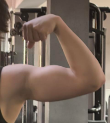
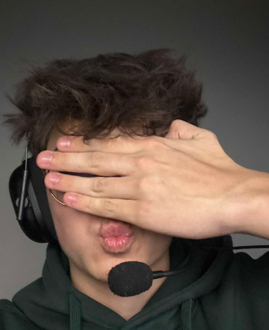
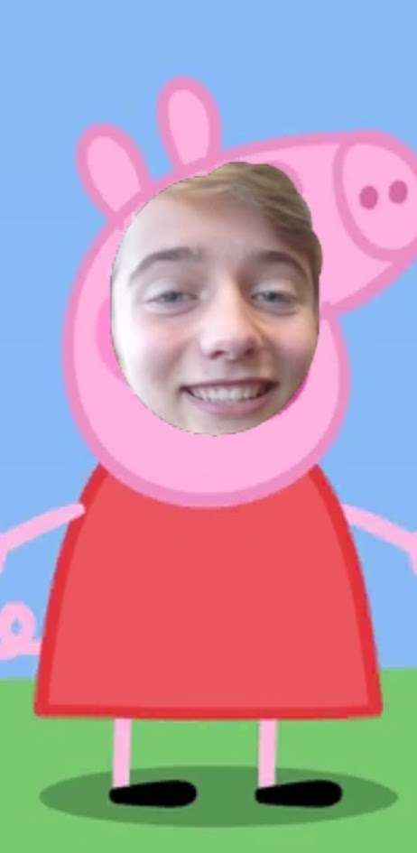
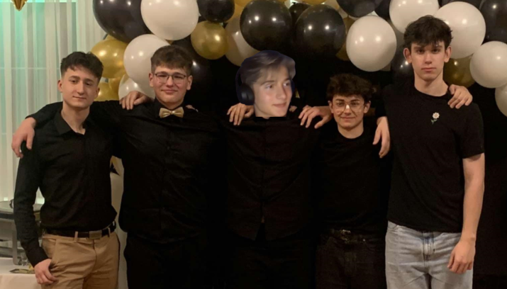

---
# https://vitepress.dev/reference/default-theme-home-page
layout: home

hero:
  name: "Kajak docs"
  text: "Docs for Kajak Game"
  tagline: How the Kajak Game flows?
  actions:
    - theme: brand
      text: Getting started
      link: /getting-started.md
    - theme: alt
      text: Dive into our Engine
      link: /getting-started-engine
    - theme: alt
      text: Explore the Game
      link: /getting-started-racing
---

[//]: # ()

  
  
  
  
 

 
